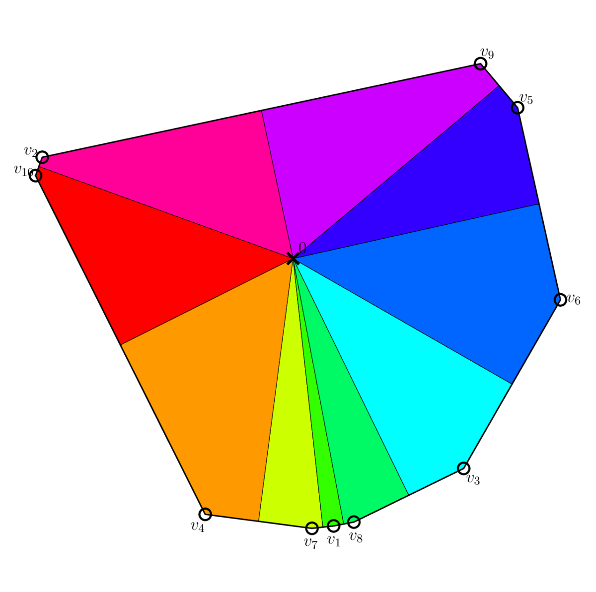

<!-- Title -->
<h1 align="center">
  Attention's forward pass and Frank-Wolfe
</h1>

<p align="center">
  <a href="https://arxiv.org/abs/2508.09628">
  
  </a>
</p>

<tt>Python</tt> codes for the paper 
**Attention's forward pass and Frank-Wolfe** by Albert Alcalde, Borjan Geshkovski and Domènec Ruiz-Balet. 


<p align="center">
  
</p>


## Abstract

*We study the hardmax limit of self-attention dynamics for token embeddings obtained in the zero-temperature ($\beta\to+\infty$) regime, and relate it to the finite-$\beta$ setting. In this limit, the update rule can be viewed as a Frank-Wolfe step for a quadratic objective over the convex hull of the current token embeddings. When the key-query matrix is negative semidefinite, the method linearly contracts all tokens to a single cluster at the origin. When it is positive semidefinite, extending the hardmax rule to the entire convex hull induces a Voronoi diagram: vertices are stationary, interior points remain in their initial cells, and each token moves along a straight line toward its cell's vertex, yielding (super-)exponential convergence. As a byproduct, we also establish well-posedness of the associated ODE limit in this regime. Returning to the finite-$\beta$ regime, we model self-attention dynamics as a Markov chain and prove dynamic metastability: with high probability, interior tokens reach near-vertex configurations in a constant number of steps and remain within a small neighborhood for times that grow exponentially in the inverse temperature $\beta$, before ultimately collapsing to the origin. Thus, the hardmax dynamics accurately approximate the finite-$\beta$ process over exponentially long time horizons.*

## Citing

```bibtex
@article{alcalde2025attention,
      title={Attention's forward pass and Frank-Wolfe}, 
      author={Albert Alcalde and Borjan Geshkovski and Domènec Ruiz-Balet},
      year={2025},
      eprint={2508.09628},
      archivePrefix={arXiv},
      primaryClass={math.OC}
}
```
